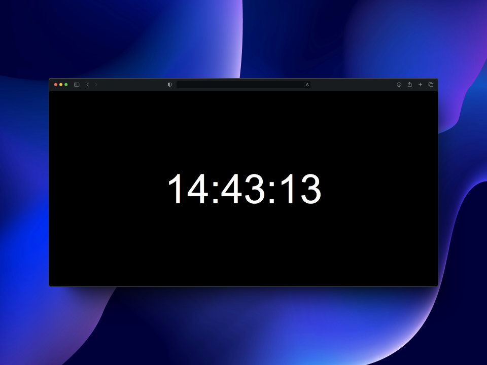

# Dead Simple Clock

I'm sure I'm not the only one who has faced this problem. Throughout the year, we all need a clock that indicates when a specific time is reached – whether it's to countdown to a birthday celebration, or simply to ring in the New Year. Until now, I've repeatedly searched the App Store for suitable apps, only to be disappointed by what I found: either the app was paid, full of ads, or simply unattractive. 

This functionality is so easy to implement that web technologies alone suffice. I decided to create a solution that is simple, elegant, and accessible to everyone.

## Features

- **Minimalist Design:** A sleek design featuring a black background with a crisp white clock.
- **Responsive Layout:** The size of the clock automatically adjusts to the display size, providing a consistent experience across devices.
- **Offline Availability:** The source code is cached in the browser, so the clock remains available even without an internet connection.
- **Web App Compatibility:** The clock can be installed as a Web App on both Android and iOS devices for convenient access.
- **Open Source & Free:** No cost, no ads – just a beautiful, functional clock that anyone can use and adapt.

## How to Use

Visit [https://maik.io/clock.html](https://maik.io/clock.html) to use the clock. Share the link with friends so they can use it too!

## Icon Credit

The icon used in this project is from [phosphoricons.com](https://phosphoricons.com/) and is licensed under the [MIT License](https://raw.githubusercontent.com/phosphor-icons/homepage/master/LICENSE). 

---

Enjoy your simple, ad-free, and elegant clock! If you encounter any issues or have suggestions for improvements, please feel free to open an issue or submit a pull request.
